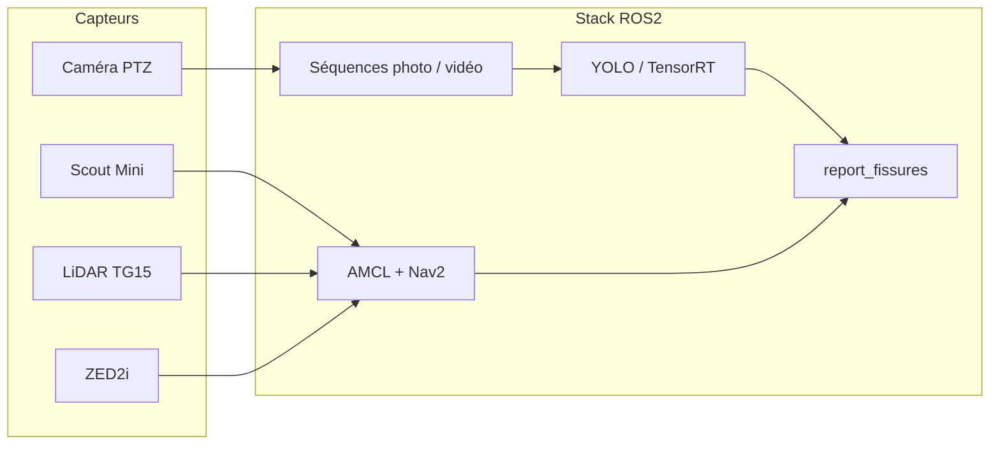

# ANDRA 2025–2026 — Robotique et détection de fissures en galerie

Projet industrie de l’[École des Mines de Nancy](https://mines-nancy.univ-lorraine.fr/) en partenariat avec l’[ANDRA](https://www.andra.fr/) (année scolaire 2025–2026).

**Thème :** *Robotique et IA en environnements complexes — exploration de la galerie souterraine de l’ANDRA avec un robot et détection avancée de fissures.*

---

## Contexte

Dans le cadre du projet **Cigéo** (stockage géologique en profondeur, site de Bure), le cisaillement entre jointures de galerie peut provoquer l’apparition et l’évolution de **fissures** sur les parois. Sur des kilomètres de galeries, leur suivi manuel est répétitif et chronophage.

Ce projet vise à **automatiser l’inspection** : un robot mobile parcourt la galerie, capture les parois, détecte les fissures par vision (IA), et **géoréférence** chaque détection sur une carte pour un suivi dans le temps.

---

## Équipe

| Membre | Rôle principal |
|--------|----------------|
| **Guichard Vincent**, **Paris Paul-Antoine** | Robotique : ROS2, capteurs, navigation, intégration terrain |
| **Lefebvre Adrien**, **Dame Lucas** | IA : datasets, entraînement et évaluation YOLO (PTZ et 360°) |

Encadrement : TechLab, tuteurs Mines Nancy, intervenant ANDRA.

Le rapport détaillé est disponible sur le dépôt : [@ANDRA_2025_2026.pdf](./@ANDRA_2025_2026.pdf)

---

## Plateforme robot

| Composant | Rôle |
|-----------|------|
| **Agilex Scout Mini** | Base mobile (odométrie roues, bus CAN) |
| **NVIDIA Jetson Orin Nano** | Calcul embarqué (ROS2, inférence GPU) |
| **YDLidar TG15** | LiDAR 2D — localisation AMCL, cartographie, obstacles |
| **Stereolabs ZED2i** | Profondeur + IMU (fusion orientation via EKF) |
| **Marshall CV-605 (PTZ)** | Prises de vue haute résolution des parois (RTSP / VISCA) |
| **Caméra 360°** (Ricoh Theta, prêt ANDRA) | Acquisition panoramique pour un futur modèle continu |

---

## Chaîne fonctionnelle (vue d’ensemble)



1. **Navigation** — Localisation sur carte préétablie (**AMCL** + **Nav2**), missions par waypoints ; le SLAM seul dérive trop sur de longues distances avec les capteurs actuels, il est utilisé uniquement pour la création de carte.
2. **Acquisition** — Séquences **step-and-go** (5 photos PTZ) ou **vidéo** à basse vitesse ; fusion possible avec une mission de navigation autonome (`patrouille_autonome`).
3. **Détection** — Modèle **YOLOv11** entraîné sur des images de galerie Bure (`best.pt`, accélération **TensorRT** sur Jetson).
4. **Géolocalisation des fissures** — Chaque détection publie une pose ; `report_fissures` la projette sur la carte.

---

## Structure du dépôt

```
ANDRA_2025-2026/
├── docs/              # Guides opérationnels (démarrage, debug, YOLO, TF, backup…)
├── scripts/           # setup.sh, build.sh, launch.sh, réseau PTZ, TensorRT…
├── ros2_ws/           # Workspace principal (packages ROS2)
├── dependencies/      # Drivers : scout_base, ydlidar, zed-ros2-wrapper
├── docker/            # Images RViz (PC) et inférence GPU (Jetson)
├── video/             # Enregistrement vidéo PTZ hors ROS
└── backup/            # Empreinte SHA256 de l’image disque 
```

Détail des dossiers et packages : [`docs/STRUCTURE.md`](docs/STRUCTURE.md).

---

## Démarrage rapide

Sur le robot (Jetson), après clonage du dépôt :

```bash
# Installation des dépendances et sourcing des workspaces
./scripts/setup.sh

# Compilation
./scripts/build.sh

# Lancement (SLAM par défaut, ou AMCL avec une carte)
./scripts/launch.sh
./scripts/launch.sh amcl ros2_ws/src/ros_launcher/map_results/ma_carte_2.yaml
```

Options modulaires (désactiver un capteur en panne) : voir [`docs/SCRIPTS.md`](docs/SCRIPTS.md) et [`docs/DEMARRAGE_ROBOT.md`](docs/DEMARRAGE_ROBOT.md).

Connexion réseau (TechLab ou hotspot `JetsonWIFI` en galerie) : [`docs/HOTSPOT.md`](docs/HOTSPOT.md).

---

## Documentation

| Sujet | Fichier |
|-------|---------|
| Structure du projet | [`docs/STRUCTURE.md`](docs/STRUCTURE.md) |
| Démarrage des nœuds | [`docs/DEMARRAGE_ROBOT.md`](docs/DEMARRAGE_ROBOT.md) |
| Détection YOLO / TensorRT | [`docs/DETECTION_YOLO.md`](docs/DETECTION_YOLO.md) |
| Missions waypoints (AMCL) | [`docs/TRAJECTOIRE_MISSION.md`](docs/TRAJECTOIRE_MISSION.md) |
| RViz2 et cartes | [`docs/VISUALISATION.md`](docs/VISUALISATION.md) |
| Arbre TF | [`docs/TF_TREE.md`](docs/TF_TREE.md) |
| Débogage ROS2 et commande SSH utile| [`docs/DEBUG.md`](docs/DEBUG.md) |
| Sauvegarde image disque | [`docs/BACKUP.md`](docs/BACKUP.md) |
| Docker (RViz / Jetson) | [`docker/README.md`](docker/README.md) |

---

## Licence et usage

Projet académique et partenariat industriel ANDRA — usage interne équipe projet / TechLab / ANDRA.
